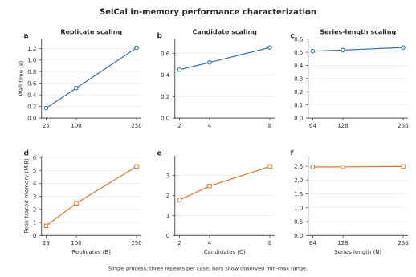

Performance characterization
============================

Run the benchmark
-----------------

From an isolated development installation at the repository root, execute:

.. code-block:: console

   python scripts/benchmark_in_memory.py --preset standard > benchmark.json

Use ``--preset smoke`` for a short wiring check. The standard preset varies the
planned replicate count (B), candidate count (C), and series length (N), with
three measured repeats per case. Every repeat invokes the public resolution,
calibration, and verification functions.

   Local standard-preset characterization on Darwin arm64 with CPython 3.11.12,
   NumPy 2.4.6, and SelCal 0.1.0. The upper row reports median wall time;
   bars span the observed minimum and maximum of three repeats and are not
   confidence intervals. The lower row reports the maximum ``tracemalloc`` peak.
   The frozen JSON receipt is the figure's authoritative data source.

The figure uses ``in_memory_standard_20260922.json``, measured after the
2026-09-19..22 changes (attainable-p guard, exact-enumeration null, verifier
enumeration check). The earlier 20260831 and 20260908 receipts and figures are
retained as historical measurements of different source bytes, not evidence for
the current implementation or a speedup comparison.

Benchmark contract
------------------

The output uses the ``selcal.benchmark.in-memory.v1`` schema. Its
``benchmark_contract_sha256`` covers the preset, complete case definitions,
execution mode, and measurement boundary; it deliberately excludes measured
times and environment values. Compare results only when the contract identity
and relevant environment fields are compatible.

.. list-table::
   :header-rows: 1
   :widths: 28 72

   * - Field
     - Interpretation
   * - ``wall_seconds``
     - Repeat-level elapsed time measured with ``time.perf_counter_ns``.
   * - ``wall_seconds_median``
     - Median of the repeat-level samples for the exact case; it is not a
       population-level performance estimate.
   * - ``peak_traced_bytes_max``
     - Maximum Python allocation high-water reported by ``tracemalloc``. Native
       NumPy allocations and total resident memory are not included.
   * - ``result_status_counts``
     - Counts of verified result states retained across repeats. A timing from a
       different status must not be merged with a complete-result timing.
   * - ``scientific_plan_sha256``
     - Identity of the resolved scientific plan used by the case. Series length
       is recorded separately because input data are not part of this plan hash.

Measurement boundary
--------------------

The timed scope is ``resolve_plan_v2`` through
``verify_calibration_result``. Synthetic input construction, Python process
startup, JSON serialization, filesystem redirection, and the unmeasured warm-up
run are excluded. Garbage collection runs before each repeat, and memory tracing
begins before the timer.

The current tool performs single-process characterization with one worker. It
does not exercise multiprocessing, multithreading, GPU acceleration, or
distributed execution because those are not current SelCal features. Hardware
availability alone does not justify adding or claiming those execution modes.

Claim boundary
--------------

Wall time and Python allocation peaks vary with operating system, interpreter,
NumPy build, processor state, background load, and thermal conditions. A local
run is therefore not a cross-platform guarantee, speedup claim, comparator
result, or M6 scientific evidence. Release-grade performance claims require a
frozen release, controlled environments, repeated supported-platform runs, and
predeclared comparisons.
